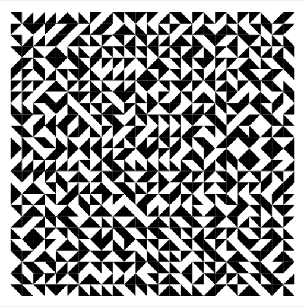

# 🎨 ARTCODE-01

## 📌 Descrição
Uma exploração inicial do uso de **padrões geométricos aleatórios** em uma grade quadrada. A composição é formada por triângulos pretos dispostos de maneira aleatória, criando um mosaico que mistura **ordem e caos**. Cada triângulo ocupa uma célula da grade, mas a direção em que ele aponta é decidida pelo algoritmo, resultando em infinitas variações possíveis.

O contraste entre o fundo branco e os triângulos pretos reforça a estética minimalista, lembrando obras de **arte concreta** e experimentos do movimento **Op Art**. 
Ao mesmo tempo, a imprevisibilidade do código adiciona um elemento de surpresa — nenhuma execução é exatamente igual à outra.

### ✨ Interatividade
➡️ É possível **mudar o padrão pressionando qualquer tecla** do teclado.  
Um experimento simples que envolvendo interação que gera um novo arranjo de triângulos, ampliando sua natureza generativa.

### 🎯 Propósito
- Introduzir o conceito de **aleatoriedade controlada**.  
- Mostrar como **regras simples** (apenas quatro orientações possíveis) podem criar **resultados complexos e esteticamente ricos**.  
- Dar ao observador/usuário a chance de participar do processo artístico através da interação.

### 🎯 Imagem

  </div>
  <div style="flex: 1; min-width: 300px;">
    
  </div>
</div>

---

## 📖 Metodologia
- **Conceito:** explorar
- variação aleatória em uma grade geométrica.  
- **Processo:** uso de `random()` para criar triângulos orientados de diferentes formas.  
- **Objetivo:** introduzir aleatoriedade como elemento estético fundamental.  

### 🔎 Code
```

<div style="display: flex; gap: 30px; align-items: flex-start;">
  <div style="flex: 1; max-height: 300px; overflow-y: auto; font-size: 12px;">

```javascript
// Definição de variáveis globais
let nb = 25; // quantidade de linhas/colunas (a grade é nb x nb)
let dim = 10; // tamanho inicial das células (será recalculado depois)
let margin = 20; // margem branca ao redor do desenho
let x, y; // coordenadas de cada célula (usadas dentro dos loops)

function setup() {
  createCanvas(550, 550); // cria a tela onde será desenhado (550x550 pixels)
  // recalcula o tamanho real de cada célula da grade
  // width é a largura total da tela → tiramos duas margens e dividimos pela quantidade de linhas
  dim = (width - 2 * margin) / nb;
  noLoop(); // desenha apenas uma vez (não fica repetindo automaticamente)
}

function draw() {
  background(255); // fundo branco (255 é o valor máximo da escala de cinza)

  // dois loops aninhados para percorrer todas as posições da grade
  for (let j = 0; j < nb; j = j + 1) {      // percorre as linhas (vertical)
    for (let i = 0; i < nb; i = i + 1) {    // percorre as colunas (horizontal)
      // calcula a posição x,y de cada célula na grade
      x = margin + i * dim;
      y = margin + j * dim;

      // configurações de estilo (sem contorno, preenchimento preto)
      noFill();     // desativa preenchimentos anteriores (precaução)
      noStroke();   // tira o contorno dos triângulos
      fill(0);      // define preenchimento preto

      // sorteia um número inteiro aleatório entre 0 e 3
      // esse número decide a orientação do triângulo na célula
      let rnd = int(random(0, 4));

      // cada condição desenha o triângulo em uma orientação diferente
      if (rnd == 0) {
        triangle(x + dim, y, x + dim, y + dim, x, y + dim); // triângulo voltado para a esquerda
      }
      else if (rnd == 1) {
        triangle(x, y, x + dim, y, x, y + dim); // triângulo voltado para baixo
      }
      else if (rnd == 2) {
        triangle(x, y, x + dim, y + dim, x, y + dim); // triângulo diagonal
      }
      else {
        triangle(x, y, x + dim, y, x + dim, y + dim); // triângulo voltado para cima
      }
    }
  }
}

function keyPressed() {
  redraw(); // redesenha a tela inteira quando qualquer tecla é pressionada
  // isso gera um novo padrão de triângulos, pois random() será sorteado de novo
}
 
